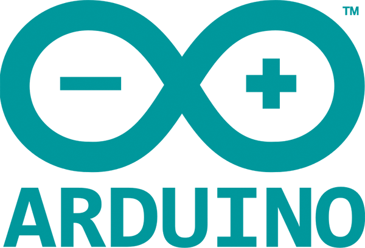
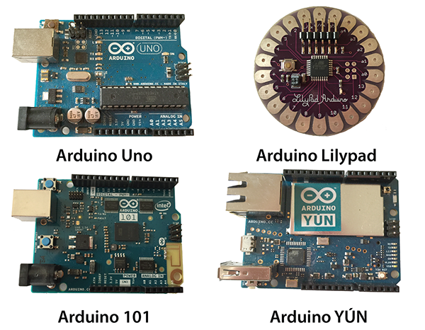
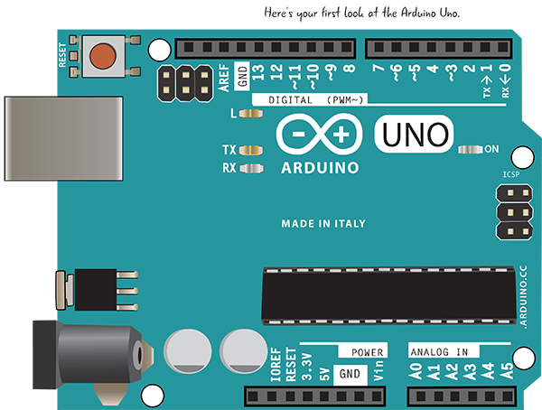
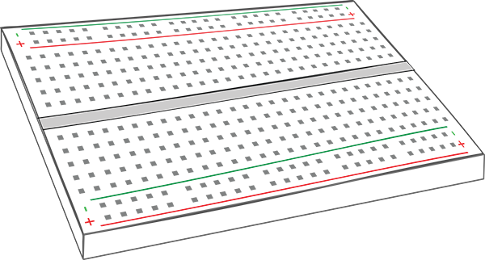
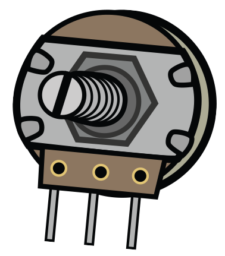

# Chapter 1: Introduction to Arduino

* Physical Computing
* Prototyping
* What Will I Need and Where Can I Get It?
* Parts and Tools
* Resources
* Summary

Quizás haya visto el Arduino en un minorista local, escuchado sobre él de un amigo que compró uno, o simplemente vio un proyecto genial en Internet que despertó su interés. ¿Qué es el Arduino? De manera más simple, es una computadora simple, asequible y de pequeña escala que se enfoca en la interacción con el mundo exterior (Figura 1-1).

La mayoría de las computadoras con las que está familiarizado se controlan casi exclusivamente a través del teclado y el mouse, la pantalla táctil o el panel táctil. Un Arduino le permite tomar información del mundo exterior con sensores que miden la temperatura, los niveles de luz y sonido, o incluso las vibraciones debajo de sus pies, y convierten estas medidas en movimiento, sonido, luz y más.

***Figura 1-1***: El logotipo de Arduino

El Arduino fue desarrollado originalmente por profesores para que sus estudiantes de diseño que no eran ingenieros pudieran crear objetos y entornos interactivos. Desde que se lanzó el Arduino original en 2005, se estima que se han vendido más de 1 millón. Diseñadores, educadores, ingenieros, aficionados y estudiantes han construido todo tipo de proyectos que sienten y responden al mundo con Arduino.

Hay muchas versiones de Arduino y cada una está diseñada para una función específica. La Figura 1-2 muestra algunas de las placas Arduino.

Hemos escrito este libro en el espíritu del equipo de Arduino. No asumimos que ya sabe programación o electrónica; le mostraremos lo que necesita saber para comenzar a utilizar Arduino. Te ayudará si eres bueno construyendo y retocando, y tienes una naturaleza determinada.

***Figura 1-2***: Hay muchas versiones de Arduino, cada una diseñada para una función diferente.

COMPUTACION FISICA
El Arduino se utiliza para construir proyectos de computación física. ¿Qué significa eso? La computación física se refiere a tomar información del mundo que nos rodea mediante el uso de entradas como sensores e interruptores y responder a esa información con salidas de algún tipo. Podría ser tan simple como encender un LED cuando una habitación se oscurece, o podría ser un sistema complejo de sonido y luz que responde a la posición de una persona en una habitación. Un Arduino puede actuar como el "cerebro" de este tipo de sistema, manejando la información que ingresa y la respuesta que sale.

El Arduino es parte del movimiento de hardware de código abierto. Veamos lo que eso significa.

¿QUÉ ES EL HARDWARE DE CÓDIGO ABIERTO?
El Arduino se define en su sitio web como una plataforma de creación de prototipos de electrónica de código abierto. En el movimiento del hardware de código abierto, los tecnólogos comparten su hardware y software para fomentar el desarrollo de nuevos proyectos e ideas. Los diseños de origen se comparten en un formato que puede modificarse y, siempre que sea posible, se utilizan materiales fácilmente disponibles y herramientas de código abierto para crear los diseños.

Al fomentar el intercambio de recursos, el movimiento de hardware de código abierto facilita el desarrollo de nuevos productos y diseños. Los proyectos de código abierto enfatizan la importancia de la documentación y el intercambio, lo que hace que la comunidad de usuarios sea un gran recurso para los estudiantes.

PROTOTIPOS
El Arduino es una plataforma de creación de prototipos. ¿Qué es la creación de prototipos? Está construyendo un modelo de sistema. Puede involucrar muchas fases, desde bocetos iniciales a través de planos detallados y una serie de refinamientos, hasta la construcción de un modelo completamente funcional que se puede replicar. O puede ser algo único y rápido que se ensambla rápidamente para probar una idea.

¿QUÉ NECESITARÉ Y DÓNDE PUEDO CONSEGUIRLO?
Hay varias versiones de Arduino; existe desde 2005 y está en constante evolución. A los efectos de este libro, nos ocupamos del Arduino Uno. Es posible que su Arduino no se vea exactamente como el Uno que se muestra en la Figura 1-3, porque hemos simplificado el dibujo para señalar las secciones que nos conciernen. Dado que Arduino es de código abierto, también puede comprar una placa que no provenga directamente de la organización Arduino. Solo sepa que para este libro nos enfocamos en Arduino Uno y placas compatibles.

