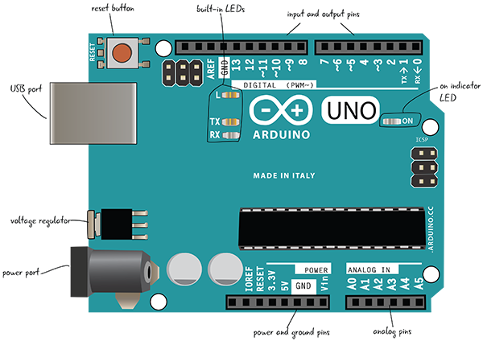

# Chapter 2: Your Arduino

* Parts of an Arduino
* Plug Your Arduino into Your Computer
* Components and Tools
* Summary

Ahora que tiene su Arduino y una serie de piezas y herramientas, veámoslas con más profundidad. El Arduino es justo lo que necesita para resolver sus necesidades interactivas diarias. En este capítulo, aprenderá sobre las partes del Arduino y cómo conectarlo a una computadora y a una fuente de alimentación. También veremos cómo desempacar nuestras partes electrónicas, clasificarlas y aprender más sobre ellas tanto en los sitios web como en las hojas de datos.

## PARTES DE UN ARDUINO

Primero, echemos un vistazo a las partes etiquetadas del board, como se muestra en la Figura 2-1.

***Figura 2-1***: Arduino Uno

Vamos a desglosar cada lado de la placa con más detalle para que pueda ver dónde se encuentra todo lo importante en el Arduino.

### ARDUINO EN DETALLE

Aprendamos un poco más sobre lo que hay en la placa Arduino. Recuerde que existen diferentes estilos de boards, por lo que las suyas pueden verse ligeramente diferentes. Estas figuras se basan en la revisión 3 de Arduino Uno. Primero veremos el lado izquierdo de la placa, con el botón de reinicio, el puerto USB, el regulador de voltaje y el puerto de alimentación, como se muestra en la Figura 2-2.

***Figura 2-2***: El lado izquierdo de la placa Arduino Uno

#### Botón Reset (reinicio)

Al igual que apagar y encender la computadora, algunos problemas con Arduino se pueden resolver presionando el botón de reinicio. Este botón reiniciará el código actualmente cargado en su Arduino. El botón de reinicio puede estar en una ubicación diferente en su placa que en la Figura 2-2, pero es el único botón.

#### Puerto USB

El puerto USB toma un cable USB estándar A-to-B, que a menudo se ve en impresoras u otros periféricos de computadora. El puerto USB tiene dos propósitos: primero, es la conexión del cable a una computadora que le permite programar la placa. En segundo lugar, el cable USB proporcionará alimentación al Arduino si no está utilizando el puerto de alimentación.

#### Regulador de voltaje

El regulador de voltaje convierte la energía conectada al puerto de alimentación en el estándar de 5 voltios y 1 amperio utilizado por Arduino. ¡Ten cuidado! Este componente se calienta mucho.

#### Puerto de alimentación

El puerto de alimentación incluye un conector tipo barril que se conecta a la alimentación directamente desde una fuente de pared (a menudo llamada wall-wart) o desde una batería. Esta energía se usa en lugar del cable USB. El Arduino puede tomar una amplia gama de voltajes (5V – 0V DC) pero se dañará si se conecta una potencia superior a esa.

Ahora veremos más de cerca el otro lado de la placa (Figura 2-3), que incluye los pines digital, analógico y de alimentación, así como el chip real de la placa.

***Figura 2-3***: El lado derecho del Arduino Uno

#### LEDs incorporados

Los LEDs marcados como TX y RX muestran si su Arduino está enviando o recibiendo datos. El marcado con L está conectado al Pin 13.

#### LED indicador de ENCENDIDO (ON)

Este LED indica que el Arduino está recibiendo energía cuando lo enciende.

#### Pines de E/S digitales

Los orificios de este lado de la placa se denominan pines de entrada/salida digital. Se utilizan para detectar el mundo exterior (entrada) o controlar luces, sonidos o motores (salida).

#### Pines TX/RX

El pin 0 y el pin 1 son pines especiales etiquetados como TX y RX. Cubriremos esto con más detalle más adelante, pero es una buena práctica dejar estos pines vacíos. Cualquier cambio que realice en su programa no se cargará si algo está conectado al Pin 0.

#### ATmega328P, Chip Negro

El chip negro en el medio de la placa es un ATmega328P. Este es el "cerebro" del Arduino: interpreta tanto las entradas/salidas como el código de programación cargado en su Arduino. Los otros componentes de la placa le permiten comunicarse con este chip al crear proyectos.

#### Pines de Alimentación y Tierra

Los pines relacionados con el poder se encuentran aquí. Puede usar estos pines para hacer funcionar la energía desde su Arduino al circuito de su placa de pruebas.

#### Pines analógicos

Estos pines toman lecturas del sensor en un rango de valores (analógico), en lugar de simplemente enviar si algo está encendido o apagado (digital).

Ahora conectemos el Arduino a su computadora. No lo vamos a programar todavía, pero ayudará a ver cómo conectarlo a la computadora a través del cable USB.

## CONECTE SU ARDUINO A SU COMPUTADORA

Necesitará un cable USB A-B, su computadora y un Arduino Uno. Si tiene un modelo de MacBook más nuevo, es posible que también necesite un adaptador USB-C-a-USB.

***Figura 2-4***: Conecte su Arduino a su computadora.

Primero, conecte el cable USB a uno de los puertos USB de su computadora como se muestra en la Figura 2-4. Cualquier puerto que esté disponible, como se muestra en la Figura 2-5, debería funcionar bien.

***Figura 2-5***: Puerto USB Close-up

Ahora que está conectado a la computadora, conecte el cable USB al puerto USB del Arduino. El puerto USB está etiquetado en la Figura 2-6.

***Figura 2-6***: Puerto USB en el Arduino

Puede ver la vista superior del puerto USB en el Arduino con el cable USB A-B en la Figura 2-7.

***Figura 2-7***: Vista superior de conectar el cable USB a Arduino

### CONECTANDO EL ARDUINO

¿Qué sucede cuando conectas el Arduino? El LED de encendido etiquetado como ON debe iluminarse. Y si esta es la primera vez que lo conecta, el LED en el Arduino cerca del Pin 13 debe parpadear, como se muestra en la Figura 2-8.

***Figura 2-8***: Los LEDs se encienden cuando el Arduino recibe energía de su computadora.

****¡Ha encendido su Arduino por primera vez!****

Siempre puede usar un cable USB y un puerto en su computadora para alimentar el Arduino. El Arduino también se puede alimentar conectándolo a una fuente de alimentación que esté enchufada a una toma de corriente.

> **Nota**
> 
> El Arduino se puede apagar desde el puerto USB o el puerto de alimentación.

### ALIMENTACIÓN DEL ARDUINO DESDE UNA FUENTE DE ALIMENTACIÓN

Necesitará una fuente de alimentación de 9–12 V CC y un Arduino. El primer paso es desconectar el cable USB, que apagará completamente el Arduino. La Figura 2-9 muestra el puerto de alimentación del Arduino.

> **Advertencia**
> 
> ¡Siempre desconecte el Arduino de una fuente de alimentación cada vez que realice cambios!

***Figura 2-9***: Puerto de alimentación en el Arduino

Conecte la fuente de alimentación al puerto de alimentación del Arduino (Figura 2-10).

***Figura 2-10***: Vista superior del puerto de alimentación del Arduino

A continuación, conecte la fuente de alimentación a un protector contra sobretensiones y luego a un tomacorriente de pared, como se muestra en la Figura 2-11.

¿Que pasa ahora? Debería ser lo mismo que cuando conectaste el Arduino a tu computadora con el cable USB: el LED etiquetado como ENCENDIDO indica que el Arduino tiene energía. Y si su Arduino está listo para usar, el LED cerca del Pin 13 comenzará a parpadear, como se ve en la Figura 2-12.

***Figura 2-11***: Conecte su fuente de alimentación a un protector contra sobretensiones.

***Figura 2-12***: LEDs parpadeando en el Arduino

Ahora conoces los dos métodos para alimentar un Arduino. Puede cambiar su fuente de energía a medida que evoluciona su proyecto; no está atrapado en el uso de una u otra.

## COMPONENTES Y HERRAMIENTAS

Ahora que ha comprado los componentes de la lista de piezas (Figura 2-13), es posible que desee obtener más información sobre las piezas individuales. Hay varios tipos diferentes de recursos disponibles que pueden ayudarlo a determinar qué partes usar y dónde colocarlas.

***Figura 2-13***: ¿Dónde encuentro información sobre mis componentes?

### CLASIFICACIÓN DE SUS PIEZAS

Lo mejor que puede hacer al desempacar todas sus piezas es separarlas por tipo. Es bueno tener todas sus resistencias en un lugar separado de sus LED, o incluso tener lugares separados para diferentes colores de LED y para resistencias de diferentes valores. La mayoría de las ferreterías o tiendas de suministros para manualidades venden cajas de plástico que facilitarán la clasificación de las piezas y encontrarlas cuando las necesite más adelante. Recomendamos algo que se parezca al cuadro que se muestra en la Figura 2-14.

***Figura 2-14***: Clasificar todos sus componentes también le ayudará a familiarizarse con ellos.

### NÚMEROS DE PIEZA Y GUÍAS DE ALMACENAMIENTO

Ahora que tiene sus partes separadas y puede identificar cuáles son, ¿dónde debería buscar para encontrar información sobre ellas? El primer lugar para comprobar la información sobre los componentes son los propios componentes. Las resistencias, los LED y la mayoría de los demás componentes se ven lo suficientemente diferentes como para que aprenda rápidamente a identificarlos. A menudo, los componentes tendrán un número de pieza en algún lugar, lo que puede ayudarlo a encontrar el sitio web de un proveedor o fabricante. Cuando pida componentes o un kit, la tienda también le enviará documentación o le indicará una página de su sitio web. Siempre consulte primero el sitio web de un proveedor de piezas y ahórrese un dolor de cabeza.

### ENCONTRAR MÁS INFORMACIÓN: FICHAS DE DATOS

Si no puede encontrar la información que busca ni en el componente ni en el sitio web, lo siguiente que debe buscar es la hoja de datos de su componente. Puede encontrarlo ingresando el número de pieza, seguido de la “hoja de datos”, en su motor de búsqueda favorito en línea. No busque solo el nombre de la pieza, ya que es probable que haya muchas versiones diferentes de su pieza en línea con información diferente. Por ejemplo, ¡hay muchos LED diferentes!

Las hojas de datos electrónicas documentan el comportamiento, la función y las limitaciones de los componentes electrónicos. Tienen una enorme cantidad de información, desde la temperatura y el comportamiento de funcionamiento y los diagramas de cableado sugeridos, hasta la composición del material y la aplicación industrial.

Por ejemplo, aquí se explica cómo encontrar una hoja de datos en línea para uno de sus LED.

1. Busque el número que identifica el LED en su factura del proveedor al que compró sus piezas. Si no puede encontrar uno, utilice este para LED rojos superbrillantes: WP7113SRD.

2. Abra un navegador y escriba el número de su pieza en su motor de búsqueda favorito, así como las palabras "hoja de datos". Si utiliza nuestro número de pieza de ejemplo, sus términos de búsqueda serán "hoja de datos WP7113SRD".

3. Los resultados de su búsqueda incluirán hojas de datos sobre su pieza, a menudo en formato PDF. Elija un par de enlaces y haga clic en ellos. Eche un vistazo a los resultados y asegúrese de que coincidan aproximadamente con el número de pieza que buscó.

A menudo puede ser abrumador examinar la hoja de datos para encontrar la información que necesita, pero las hojas de datos son útiles, especialmente cuando no está seguro de qué componentes está manejando. Comencemos mirando una hoja de muestra, como se muestra en la Figura 2-15.

***Figura 2-15***: Hoja de datos para LED que se encuentra en un estante

Su hoja de datos contiene muchas partes y no toda la información técnica será importante para su proyecto, pero puede ayudarlo si se queda atascado.

## RESUMEN

Ahora debería sentirse cómodo con el diseño de su Arduino. Sabes cómo encender el Arduino desde el USB y los puertos de alimentación. Si alguna vez no está seguro acerca de sus componentes, puede buscarlos en línea en el sitio web donde los compró o buscar su hoja de datos. En el próximo capítulo, veremos cómo usar algunos componentes para construir nuestro primer circuito.

