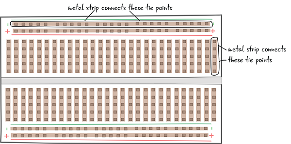

# Chapter 3: Meet the Circuit

* The Circuit: Building Block of Electronics
* The Schematic
* Using a Breadboard
* Building a Circuit
* A Look at the Battery
* Power for Our Circuit: Electricity
* Debugging the Circuit
* The Multimeter
* Using the Multimeter
* Back to Debugging Our Circuit
* Summary

# Conoce el circuito

En el último capítulo, aprendiste un poco sobre Arduino y sus partes. También le presentaron algunos de los componentes y herramientas que utilizará para completar los proyectos de este libro. En este capítulo, aprenderá algo de la práctica y la teoría de la electrónica que necesitará saber para construir circuitos usando Arduino. Todavía no usaremos un Arduino, pero volveremos a eso en breve.

## EL CIRCUITO: BLOQUE DE CONSTRUCCIÓN DE ELECTRÓNICA

El circuito es el bloque de construcción básico para todos los proyectos de electrónica que construiremos con Arduino.

Puede construir muchos tipos diferentes de proyectos con un Arduino; solo está limitado por su imaginación. Aunque existen muchos tipos diferentes de proyectos, todos los proyectos de este libro se construyen utilizando circuitos.

Primero, veremos qué es un circuito; luego, construirás tu primer circuito. También veremos técnicas para representar circuitos electrónicos visualmente y le mostraremos cómo probar sus circuitos.

La Figura 3-1 ilustra algunos proyectos de Arduino. Puede ver que los circuitos en estos proyectos toman diferentes formas. En el robot de cartón, no se puede ver el circuito, pero eso es lo que controla al robot.

***Figura 3-1***: Algunos ejemplos de proyectos que usan Arduino como parte de un circuito

Veamos más de cerca qué es un circuito.

### ¿QUÉ ES UN CIRCUITO?

Si alguna vez has estado en una carrera de autos, sabes que se refieren a la pista como un circuito. Un circuito simplemente significa que hay un circuito cerrado completo, como se muestra en los circuitos de la Figura 3-2. Los coches pasan desde la línea de salida y terminan en el mismo lugar.

***Figura 3-2***: Pistas del circuito

Lo mismo ocurre con los circuitos electrónicos. Un circuito electrónico describe un circuito cerrado y completo. Un circuito incluye todos los componentes electrónicos necesarios para una tarea, así como cables u otro material que permitirá que la electricidad fluya entre los componentes conectados, como puede ver en la Figura 3-3.

***Figura 3-3***:

***Figura 3-4***:

***Figura 3-5***:

***Figura 3-6***:

***Figura 3-7***:

***Figura 3-8***:

***Figura 3-9***:

***Figura 3-10***:

***Figura 3-11***:

***Figura 3-12***:

***Figura 3-13***:

***Figura 3-14***:

***Figura 3-15***:

***Figura 3-16***:

***Figura 3-17***:

***Figura 3-18***:

***Figura 3-19***:

***Figura 3-20***:

***Figura 3-21***:

***Figura 3-22***:

***Figura 3-23***:

***Figura 3-24***:

***Figura 3-25***:

***Figura 3-26***:

***Figura 3-27***:

***Figura 3-28***:

***Figura 3-29***:

***Figura 3-30***:

***Figura 3-31***:

***Figura 3-32***:

***Figura 3-33***:

***Figura 3-34***:

***Figura 3-35***:

***Figura 3-36***:

***Figura 3-37***:

***Figura 3-38***:

***Figura 3-39***:

***Figura 3-40***:

***Figura 3-41***:

***Figura 3-42***:

***Figura 3-43***:

***Figura 3-44***:

***Figura 3-45***:

***Figura 3-46***:

***Figura 3-47***:

***Figura 3-48***:

***Figura 3-49***:

