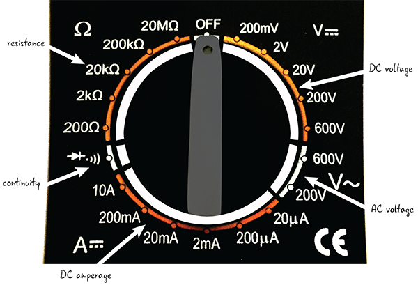

# Chapter 3: Meet the Circuit

* The Circuit: Building Block of Electronics
* The Schematic
* Using a Breadboard
* Building a Circuit
* A Look at the Battery
* Power for Our Circuit: Electricity
* Debugging the Circuit
* The Multimeter
* Using the Multimeter
* Back to Debugging Our Circuit
* Summary

# Conoce el circuito

En el último capítulo, aprendiste un poco sobre Arduino y sus partes. También le presentaron algunos de los componentes y herramientas que utilizará para completar los proyectos de este libro. En este capítulo, aprenderá algo de la práctica y la teoría de la electrónica que necesitará saber para construir circuitos usando Arduino. Todavía no usaremos un Arduino, pero volveremos a eso en breve.

## EL CIRCUITO: BLOQUE DE CONSTRUCCIÓN DE ELECTRÓNICA

El circuito es el bloque de construcción básico para todos los proyectos de electrónica que construiremos con Arduino.

Puede construir muchos tipos diferentes de proyectos con un Arduino; solo está limitado por su imaginación. Aunque existen muchos tipos diferentes de proyectos, todos los proyectos de este libro se construyen utilizando circuitos.

Primero, veremos qué es un circuito; luego, construirás tu primer circuito. También veremos técnicas para representar circuitos electrónicos visualmente y le mostraremos cómo probar sus circuitos.

La Figura 3-1 ilustra algunos proyectos de Arduino. Puede ver que los circuitos en estos proyectos toman diferentes formas. En el robot de cartón, no se puede ver el circuito, pero eso es lo que controla al robot.

***Figura 3-1***: Algunos ejemplos de proyectos que usan Arduino como parte de un circuito

Veamos más de cerca qué es un circuito.

### ¿QUÉ ES UN CIRCUITO?

Si alguna vez has estado en una carrera de autos, sabes que se refieren a la pista como un circuito. Un circuito simplemente significa que hay un circuito cerrado completo, como se muestra en los circuitos de la Figura 3-2. Los coches pasan desde la línea de salida y terminan en el mismo lugar.

***Figura 3-2***: Pistas del circuito

Lo mismo ocurre con los circuitos electrónicos. Un circuito electrónico describe un circuito cerrado y completo. Un circuito incluye todos los componentes electrónicos necesarios para una tarea, así como cables u otro material que permitirá que la electricidad fluya entre los componentes conectados, como puede ver en la Figura 3-3.

***Figura 3-3***: El flujo del circuito comienza y termina con la fuente de energía.

### ¿POR QUÉ ESTAMOS HACIENDO CIRCUITOS?

Piense por un momento en los interruptores de luz de su hogar como modelo. Para encender o apagar un interruptor, debe estar en contacto físico con el interruptor. En nuestros proyectos, Arduino controlará el comportamiento de los componentes electrónicos. Nuestros componentes electrónicos estarán dispuestos en un circuito, y Arduino debe ser parte de ese circuito para que pueda controlar el comportamiento.

Los circuitos permiten que Arduino se conecte a los componentes eléctricos, apagando y encendiendo una variedad de objetos (parlantes, LED, motores, etc.) o tomando información del mundo exterior ("¿Qué temperatura hace?"; "¿Está el interruptor encendido? ? ”; Etc.). Siempre que averigüemos cómo conectar Arduino al objeto, podemos controlarlo con electricidad y, más tarde, con programación.

### ¿QUÉ COMPONE A UN CIRCUITO?

Hay dos partes principales que componen un circuito: ***líneas conductoras*** y ***componentes***.

#### Líneas conductoras

Aunque la mayor parte del enfoque de un circuito se coloca en los componentes, no puede tener un circuito sin algún tipo de conexión entre los componentes. Nuestras computadoras y dispositivos electrónicos contienen placas de circuito impreso (PCB). Los PCB, que no conducen electricidad, están compuestos por capas base de material sobre las que se han aplicado líneas finas de material conductor, como se ve en la Figura 3-4. Las líneas conductoras conectan componentes que están soldados a la PCB. Si miras una PCB, notarás las líneas plateadas brillantes que se extienden entre los componentes, conectándolos. Estas líneas son como cables pegados a una superficie plana.

***Figura 3-4***: Detalle de placa de circuito impreso

#### Componentes

Los componentes son el otro requisito para un circuito completo. Observamos una lista completa de componentes para comprar en el Capítulo 1, "Introducción a Arduino". Los componentes forman las ubicaciones que deben conectarse dentro de un circuito (Figura 3-5).

***Figura 3-5***: Los circuitos están hechos de componentes.

En la Figura 3-6, puede ver que los cables de los componentes actúan como líneas conductoras.

***Figura 3-6***: La electricidad fluye a través de líneas conductoras.

### ¿POR DÓNDE EMPEZAMOS?

***El primer circuito que vamos a construir juntos es una linterna de bombilla LED que funciona con una batería***. Este circuito es un gran proyecto para principiantes porque la luz que se enciende confirma visualmente que el circuito está funcionando. El circuito de la linterna también demuestra las técnicas básicas de construcción de circuitos que necesitará en todos los proyectos de este libro.

La Figura 3-7 es un dibujo del circuito una vez completado, con las partes anotadas. Explicaremos lo que hacen las partes en detalle, parcialmente en este capítulo y también en los próximos capítulos. Por ahora, sepa que este circuito se construirá a partir de un LED, una resistencia, un puente, una batería de 9 V y una tapa de batería dispuesta en una placa de pruebas, componentes que conoció en el Capítulo 1.

Hay muchas formas diferentes de representar o dibujar circuitos para transmitir la información necesaria. En la Figura 3-7, hemos hecho una aproximación de cómo se verá el circuito cuando lo construya. Esta no es siempre la forma más clara de ver lo que está sucediendo; algunos circuitos tienen muchas partes que están conectadas de formas complejas. Los esquemas son una excelente manera de hacer un dibujo de un circuito que tiene partes simplificadas y mostrar cómo están conectadas. Echemos un vistazo más de cerca a cómo funcionan los esquemas.

***Figura 3-7***: El circuito que construiremos

## EL SCHEMATIC - ESQUEMA

***Un esquema es un diagrama de las relaciones de los componentes electrónicos en un circuito***. En un esquema, verá los componentes que forman parte del circuito y cómo se unen entre sí. Comencemos mirando un esquema simple que representa nuestro circuito básico. Pronto entraremos en detalles sobre lo que significa cada símbolo en el esquema, pero por ahora echemos un vistazo rápido. La figura 3-8 compara un esquema del circuito que estamos a punto de construir con un dibujo del circuito.

***Figura 3-8***: Esquema del circuito con un dibujo del circuito.

### ¿POR QUÉ ES IMPORTANTE APRENDER A LEER UN ESQUEMA?

La mayoría de los proyectos y componentes electrónicos están representados por esquemas, no necesariamente por dibujos o fotografías. A medida que avancen sus habilidades electrónicas y desee crear sus propios proyectos fuera de este libro, deberá poder leer y dibujar esquemas para investigar sus proyectos, así como describirlos y construirlos.

Comenzamos con esquemas simples; construiremos representaciones más complejas a medida que construimos proyectos más complejos en el libro. Al mirar los esquemas en línea o en otra documentación, puede notar que a veces hay variaciones en la forma en que se dibujan o organizan los símbolos. No se preocupe si todos los símbolos esquemáticos no se ven exactamente iguales, como se muestra en la Figura 3-9.

***Figura 3-9***: Símbolos esquemáticos para LEDs

### DIAGRAMA DE SU CIRCUITO: EL ESQUEMA

Ha aprendido que un esquema es la forma estándar de representar las relaciones eléctricas en un circuito. Todos los componentes electrónicos de uso común tienen un símbolo para representarlos dentro de los diagramas esquemáticos electrónicos para dejar en claro lo que se adjunta dentro del circuito. La figura 3-10 muestra un circuito básico de un LED, una resistencia y una batería. El LED tiene una orientación, un cable positivo (ánodo) y un cable negativo (cátodo), como se menciona en el Capítulo 1.

Los esquemas se preocupan principalmente por diagramar cómo se conectan los componentes en el circuito, y sacrificarán la claridad en cómo se configuran físicamente los componentes para demostrar mejor cómo se conectan electrónicamente.

***Figura 3-10***: Esquema anotado del circuito.

La Tabla 3-1 muestra los símbolos de los componentes que están en nuestro primer circuito. La página de Wikipedia sobre símbolos electrónicos es un buen lugar para obtener una descripción general de muchos de los símbolos utilizados en los esquemas: https://en.wikipedia.org/?title=Electronic_symbol.

***Tabla 3-1***: Componentes con sus símbolos esquemáticos

COMPONENTE | DESCRIPCIÓN | SIMBOLO EN EL ESQUEMA
-----------|-------------|----------------------
 | Batería | 
 | LED (diodo emisor de luz) | 
 | Resistencia | 

También hay algunas otras formas en que se pueden dibujar los símbolos de una fuente de energía, como puede ver en la Figura 3-11. Cubriremos los conceptos de *Potencia* y *Tierra* más adelante en el capítulo, pero reconocer estos símbolos lo ayudará a comprender lo que está sucediendo en nuestro circuito.

***Figura 3-11***: Símbolos esquemáticos de potencia y tierra.

### DIBUJAR UN ESQUEMA

Ha visto un ejemplo de un esquema, así como los símbolos que se utilizan en el esquema de nuestro primer circuito. ¿Cómo se conectan los símbolos para dibujar un esquema?

Comenzaremos con el símbolo de una resistencia en la Figura 3-12. Recuerde que la resistencia no tiene una orientación positiva-negativa, por lo que no importa qué extremo es cuál.

***Figura 3-12***: Símbolo esquemático de una resistencia

A continuación, dibujaremos el símbolo del LED y lo conectaremos a la resistencia con una línea continua. ¿Por qué la línea es sólida? Recuerde que estamos representando la conexión física entre los componentes del circuito, al igual que las líneas plateadas conductoras en la PCB.

El extremo positivo, o ánodo, se conecta a la resistencia como lo hará en el circuito cuando lo construyamos, como se ve en la Figura 3-13. Cuando conectamos la batería, la energía fluirá a través de la resistencia hasta el extremo positivo del LED.

***Figura 3-13***: Resistencia conectada al ánodo del LED

Ahora agregamos el símbolo de la batería y lo conectamos a los símbolos de LED y resistencia, como se muestra en la Figura 3-14. El extremo negativo del LED, o cátodo, se conecta al extremo negativo de la batería.

***Figura 3-14***: Esquema del circuito

Podemos ver en este esquema que un extremo de la resistencia está conectado a la alimentación, o el signo más en la batería. El otro extremo de la resistencia está conectado al extremo positivo del LED. El extremo negativo del LED está conectado a tierra, o el signo menos. Nuestro esquema representa el bucle completo de nuestro circuito.

## USANDO UN BREADBOARD

¿Cómo conectamos los componentes para construir un circuito? Si observa la Figura 3-15, puede ver que hay una placa de pruebas debajo de todos los componentes.

¿Por qué usamos una placa de pruebas? El breadboard nos permite conectar todos nuestros componentes. Nunca podríamos unir todas las piezas con los dedos, y no queremos unirlas permanentemente entre sí inicialmente. Sabemos que un circuito es un bucle y que los componentes deben estar conectados. La placa de pruebas nos permite conectar nuestros componentes entre sí rápidamente y nos da la flexibilidad de ajustar fácilmente nuestros circuitos. El uso de una placa de pruebas nos permite crear rápidamente un prototipo de nuestros proyectos.

***Figura 3-15***: El circuito que estaremos construyendo, con la placa de pruebas marcada

Nota
El uso de una placa de pruebas nos permite unir componentes entre sí rápidamente y realizar ajustes en nuestro circuito.

CONCEPTOS BÁSICOS DEL PANEL
Has visto imágenes de una placa de pruebas y circuitos montados en una placa de pruebas. También sabe que el uso de una placa de pruebas le permite crear prototipos de circuitos rápidamente y probarlos. ¿Cómo se construye una placa de pruebas? Veamos una vista de "rayos X" de una placa de pruebas.

Advertencia
En realidad, no retire el respaldo; hacerlo podría arruinar su placa de pruebas.

Una placa de pruebas tiene tiras de metal recubiertas de plástico con una rejilla de agujeros en la parte superior. Los agujeros, llamados puntos de unión, se colocan a intervalos regulares y se organizan en filas y columnas.

En la Figura 3-16, puede ver las tiras de metal dispuestas sobre filas y columnas de puntos de unión. Todos los puntos de unión que están conectados a una de las tiras de metal están conectados entre sí.

***Figura 3-16***:

***Figura 3-17***:

***Figura 3-18***:

***Figura 3-19***:

***Figura 3-20***:

***Figura 3-21***:

***Figura 3-22***:

***Figura 3-23***:

***Figura 3-24***:

***Figura 3-25***:

***Figura 3-26***:

***Figura 3-27***:

***Figura 3-28***:

***Figura 3-29***:

***Figura 3-30***:

***Figura 3-31***:

***Figura 3-32***:

***Figura 3-33***:

***Figura 3-34***:

***Figura 3-35***:

***Figura 3-36***:

***Figura 3-37***:

***Figura 3-38***:

***Figura 3-39***:

***Figura 3-40***:

***Figura 3-41***:

***Figura 3-42***:

***Figura 3-43***:

***Figura 3-44***:

***Figura 3-45***:

***Figura 3-46***:

***Figura 3-47***:

***Figura 3-48***:

***Figura 3-49***:

