# Chapter 4: Programming the Arduino

* Arduino, Circuits, and Code: Bringing Everything Together
* What’s an IDE?
* Downloading the Arduino IDE: Getting Started
* The Sketch: The Basic Unit of Arduino Programming
* Debugging: What to Do if the LED Isn’t Blinking
* LEA4_Blink Sketch: An Overview
* setup() and loop(): The Guts of Your Code
* Looking at loop(): What Happens Over and Over
* A Schematic of the Arduino
* Building the Basic Circuit
* SOS Signal Light: Creating More Complex Timing
* Summary

En este capítulo, comenzará a ver cómo el Arduino controla la electrónica con los programas que escribe. Primero configurará el software para programar el Arduino en una computadora; luego, conectará su Arduino a una placa de pruebas. Le mostraremos cómo construir una luz de señal SOS usando un LED. Aprenderá reglas básicas sobre la escritura de código y se familiarizará con la escritura de código en el entorno Arduino. Para este capítulo, necesita saber cómo conectar su Arduino a una computadora y cómo construir un circuito básico en una placa de pruebas.

## ARDUINO, CIRCUITOS Y CÓDIGO: UNIENDO TODO

Esta es su primera oportunidad de combinar circuitos de construcción con programación básica. Cuando agrega programación y el Arduino a su circuito, tiene más control sobre el circuito; su LED puede encenderse y apagarse en diferentes patrones. Aprenderá a programar el Arduino y a conectarlo a una placa de pruebas para construir un circuito complejo en el que la sincronización de los componentes en el circuito está controlada por la serie de instrucciones cargadas en el Arduino. Para ilustrar esto, le mostraremos cómo crear una luz de señal SOS con un LED que se enciende y apaga de acuerdo con el tiempo controlado por Arduino.

A partir de este momento, la mayoría de los proyectos incluirán las tres partes que se muestran en la Figura 4-1: el código, el Arduino y un circuito en una placa de pruebas. Discutiremos la combinación de los tres elementos y cómo interactúan entre sí en este capítulo.

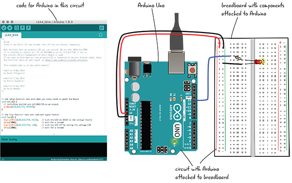

***Figura 4-1***: Código, Arduino y la placa de pruebas

Analizamos el Arduino y algunas de sus características en el Capítulo 2, "Su Arduino". En el Capítulo 3, “Conozca el circuito”, aprendió un poco sobre la electrónica y los circuitos a pequeña escala. Lo guiaremos a través de la descarga y el uso del IDE de Arduino en este capítulo, lo que le permitirá cargar código, cambiando el comportamiento del Arduino.

Así como le mostraremos los circuitos necesarios a lo largo del libro, también incluiremos todos los ejemplos de código que necesitará para ejecutar sus proyectos.

Para codificar, necesitará el software de Arduino instalado en su computadora. Descargarás e instalarás el IDE de Arduino. ¿Qué es un IDE? Vamos a ver.

## ¿QUÉ ES UN IDE?

Un entorno de desarrollo integrado (IDE) es una aplicación de software que le permite escribir código y probar ese código en el lenguaje de programación que admite el IDE.

Si tiene experiencia en programación, es posible que haya usado otro IDE para escribir, probar, depurar y convertir su código en algo que la computadora entienda. Si no lo ha hecho, el IDE de Arduino es un buen lugar para comenzar; es relativamente simple y fácil de entender.

El equipo de Arduino ha diseñado un IDE para usar con sus dispositivos que tiene todas las funciones que necesita. Tiene un editor de código incorporado, que es un programa que se utiliza para escribir los archivos de texto que crea al programar. Puede probar su código en el IDE y resolver cualquier problema emergente con la ayuda de un área de mensajes que muestra errores en su código y una consola que proporciona más detalles sobre la naturaleza de estos errores. Tiene botones para que pueda verificar su código, guardarlo, crear una nueva ventana de código, cargarlo en su Arduino y más. Esto coincide muy bien con el diagrama de flujo básico para proyectos Arduino como se muestra en la Figura 4-2.

> **Nota**
> 
> Subir es transferir las instrucciones que escribe en el editor de código al "cerebro" del Arduino para que su código controle el Arduino.

***Figura 4-2***: Diagrama de flujo de Arduino

El IDE está disponible gratuitamente en el sitio web de Arduino en arduino.cc/en/Main/Software. Es posible programar un Arduino usando otro editor de texto o IDE, pero nos quedaremos usando el IDE de Arduino en este libro.

### ¿QUÉ HAY EN EL ARDUINO IDE?

Entonces, ¿qué hay en el IDE?

* Una ventana del editor de código donde escribe su código
* Un área de mensajes que brinda información sobre su código.
* Una consola de errores que brinda información detallada y ayuda en la depuración.
* Menús que le permiten establecer propiedades para su Uno y cargar ejemplos de código y otras funciones
* Botones para verificar el código, cargarlo en Arduino, guardar código, crear una nueva ventana de código y más

### ¿QUÉ ES CÓDIGO?

En términos básicos, el código se usa para dar instrucciones a la computadora. Usamos código para hablar en el idioma que la computadora entiende (en este caso, el idioma Arduino) con el fin de realizar un conjunto de tareas o configurar una serie de respuestas programadas. Las computadoras tienen dificultades para comprender lo que usted quiere decir, insinuar o sugerir. No son capaces de los detalles más finos del lenguaje, por lo que usamos código para simplificar las instrucciones a un conjunto de comandos en un nivel fundamental.

Ha visto lo que hay en un IDE, así como una descripción básica del código. Echemos un vistazo rápido al IDE de Arduino.

### IDE ARDUINO: PRIMER VISTAZO

Aquí está su primer vistazo al IDE de Arduino. No se preocupe por memorizar ninguna de las partes o lo que hacen, esto es solo un primer vistazo. Cubriremos todas las partes en detalle más adelante en este capítulo y en el resto del libro.

Como puede ver en la Figura 4-3, los menús aparecen en la parte superior de la ventana. También hay botones para funciones de uso frecuente, como guardar, un área donde puede escribir código y algunas áreas de mensajes.

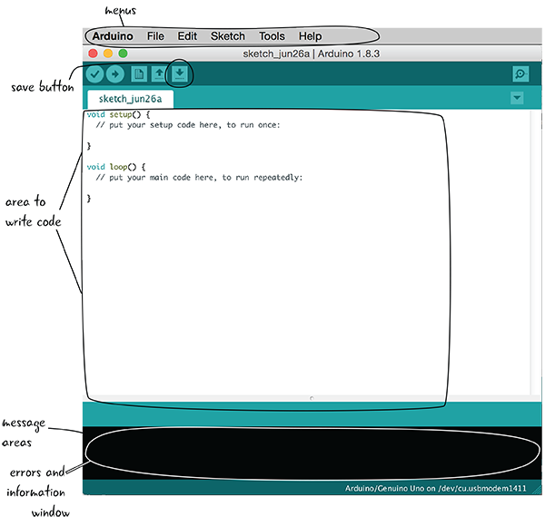

***Figura 4-3***: IDE de Arduino

Ahora que tiene una idea de lo que hay en un IDE (y, específicamente, en el IDE de Arduino), puede descargarlo e instalarlo en su computadora.

## DESCARGAR ARDUINO IDE: COMENZAR

El IDE que utilizará para programar su Arduino es gratuito y está disponible en el sitio de Arduino. El procedimiento de instalación es ligeramente diferente para la plataforma Mac que para la plataforma Windows, por lo que lo guiaremos a través del proceso de descarga e instalación para ambos.

> **Nota**
> 
> La URL nuevamente para descargar el IDE es https://www.arduino.cc/en/software.

### SI ESTÁ UTILIZANDO UNA MAC

La página de descarga se parecerá a la Figura 4-4. Los sitios web cambian con frecuencia, al igual que el software, por lo que pueden verse diferentes cuando los visita. Haga clic en el enlace para descargar la versión para Mac del software. Asegúrese de descargar la última versión recomendada de Arduino IDE para Mac.

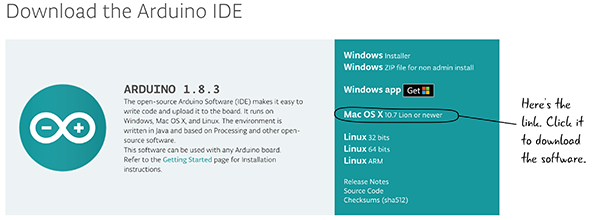

***Figura 4-4***: Descarga de Arduino IDE para Mac

Al hacer clic en el enlace, se comenzará a descargar una versión comprimida del IDE de Arduino. Estará en la ubicación de descarga predeterminada en su computadora, probablemente la carpeta Descargas. Cuando haya terminado de descargarse, haga doble clic en el archivo comprimido para descomprimirlo. El archivo descomprimido se llamará Arduino.app y tendrá un aspecto similar al de la Figura 4-5.

> **Nota**
> 
> Si no ve `.app`, no se preocupe, significa que su computadora está configurada para no mostrar extensiones de archivo.

***Figura 4-5***: Iconos para la aplicación Arduino

Mueva el archivo `Arduino.app` a la carpeta Aplicaciones en su computadora, como se muestra en la Figura 4-6.

Ahora ha descargado e instalado el IDE de Arduino en su Mac.

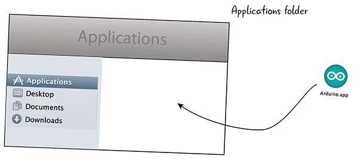

***Figura 4-6***: Arrastra el ícono a tu carpeta de Aplicaciones.

### SI ESTÁ UTILIZANDO UNA PC CON WINDOWS

Descargar y configurar el software para una PC con Windows es muy similar a los pasos que se toman para una computadora Mac, pero hay algunos pasos menores adicionales que debe seguir para asegurarse de que la computadora y el Arduino puedan comunicarse.

Primero tendrás que descargar el software. La URL es la misma que para la descarga de Mac. Asegúrese de descargar la última versión recomendada de Arduino IDE para Windows, como se muestra en la Figura 4-7.

> **Nota**
> 
> La URL nuevamente para descargar el IDE es https://www.arduino.cc/en/software.

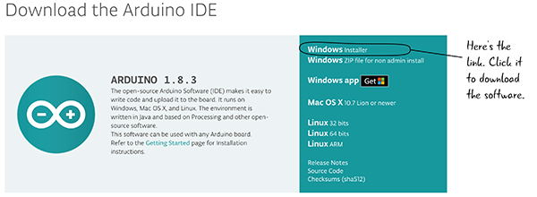

***Figura 4-7***: Descarga de Arduino IDE para Windows

Le recomendamos que utilice el enlace de Windows Installer. Si está compartiendo la computadora, por ejemplo, está usando una computadora en la escuela o en el trabajo donde no es el único usuario, es posible que deba descargar la versión marcada como "instalación no administrativa".

Cuando termine de descargarse, habrá un archivo EXE con el nombre de la versión de Arduino en su ubicación de descarga predeterminada, generalmente la carpeta Descargas. Haga doble clic en este archivo para iniciar el proceso de instalación.

El primer cuadro de diálogo le pide que acepte el Acuerdo de licencia de Arduino (Figura 4-8). Al hacer clic en "Acepto", pasará al siguiente paso de la instalación.

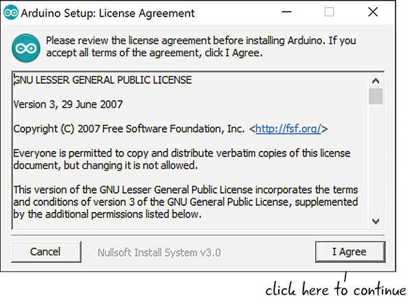

***Figura 4-8***: Acuerdo de licencia de Arduino

Con las Opciones de instalación de configuración de Arduino, asegúrese de que las casillas Instalar controlador USB y Asociar archivos `.ino` estén marcadas (Figura 4-9). Crear acceso directo al menú de inicio y Crear acceso directo al escritorio son opcionales, pero lo ayudarán a navegar al IDE de Arduino en el futuro.

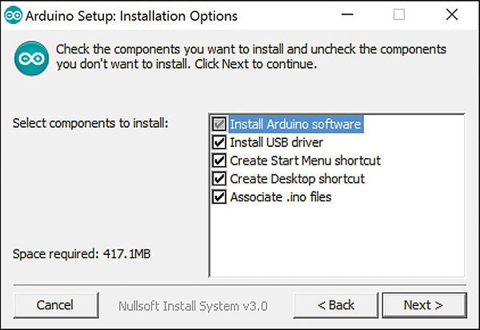

***Figura 4-9***: Opciones de instalación

Dependiendo de su configuración y su versión de Windows, es posible que obtenga un cuadro emergente de seguridad de Windows preguntando sobre la instalación del controlador USB. Haga clic en Instalar cada vez que aparezca un cuadro de diálogo de seguridad para permitir que Arduino IDE se instale por completo (Figura 4-10).

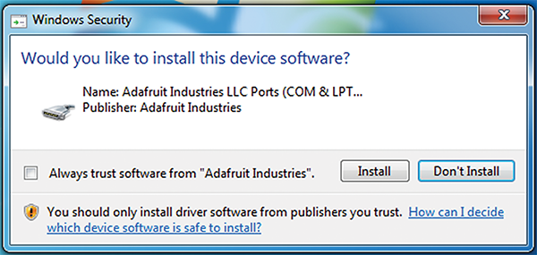

***Figura 4-10***: Cuadro de diálogo de seguridad

¡Eso es! Ahora su Arduino IDE está listo para ejecutarse en su PC con Windows.

### CONECTE SU ARDUINO A SU COMPUTADORA

Ha instalado el IDE de Arduino, por lo que ahora es el momento de conectar su Arduino a su computadora para que pueda programarlo.

Conecte su cable USB al Arduino y conecte el otro extremo del USB a su computadora, como en la Figura 4-11.

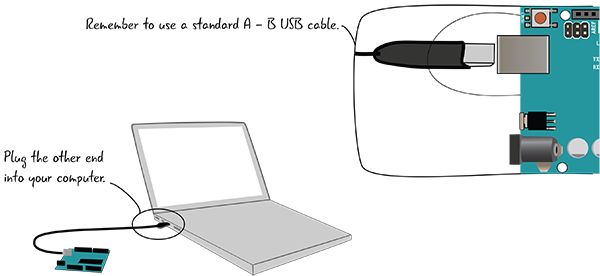

***Figura 4-11***: Conecte su Arduino a su computadora.

El LED marcado como ON debería iluminarse, y si su Arduino es nuevo fuera de la caja, la luz cerca del Pin 13 debería parpadear, al igual que cuando probó enchufar su Arduino para el Capítulo 2 (Figura 4-12).

***Figura 4-12***: LEDs indicadores

### EL IDE ARDUINO: ¿QUÉ HAY EN LA INTERFAZ?

Echemos un vistazo al IDE de Arduino en la Figura 4-13 ahora que lo ha lanzado.

El IDE de Arduino le permite verificar si su Arduino está conectado a la computadora, verificar su código en busca de errores, cargar cualquier código que escriba para controlar su Arduino y tiene algunas otras opciones útiles para comprender cómo se está comportando el Arduino. Veremos todas las funciones con mucho más detalle antes de que empieces a escribir código para tu Arduino.

Un programa que escribimos en el editor de código para Arduino se llama ***sketch***. Cuando inicie el software por primera vez, verá la esencia de un boceto. Explicaremos cómo se usa el código que está ahí cuando comienzas a programar tu Arduino.

> **Nota**
> 
> Un ***sketch*** es el nombre de un programa que escribe para Arduino.

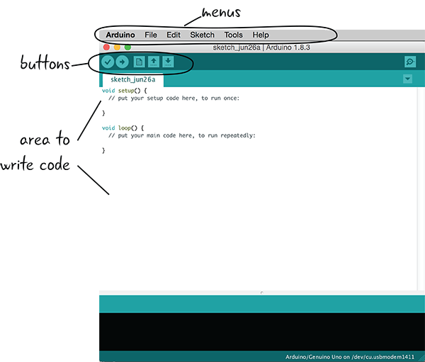

***Figura 4-13***: Conceptos básicos de Arduino IDE

> **Advertencia**
> 
> Una peculiaridad del IDE de Arduino es que si cierra todas las ventanas de sketch, el IDE intentará cerrarse. Le pedirá que guarde un sketch si realizó algún cambio, pero de lo contrario se cerrará.

Tendrá que configurar algunos ajustes antes de comenzar a programar. Veámoslos ahora.

### CONFIGURAR EL IDE

Se deben configurar dos configuraciones importantes en el IDE de Arduino para que su computadora pueda comunicarse con su Arduino Uno. Debe especificar qué versión del hardware o placa Arduino está utilizando y qué conexión o puerto utilizará para la comunicación entre el Arduino y su computadora. Esta configuración será la misma siempre que esté utilizando el mismo Arduino Uno. (La configuración será diferente si está usando otro Arduino. Estamos usando el mismo Arduino para todos los proyectos de este libro).

#### Especifique la versión de hardware de Arduino

En el Capítulo 1, viste que hay muchas versiones diferentes de Arduino. Para programar el tuyo, debes indicar en el software qué versión de la placa Arduino estás usando.

Para hacer esto, vaya al menú Tools y seleccione Board, como se muestra en la Figura 4-14. En el menú desplegable, seleccione Arduino Uno/Genuino. Una vez que esto esté configurado, deberá configurar un puerto a través del cual su Arduino se comunicará con su computadora.

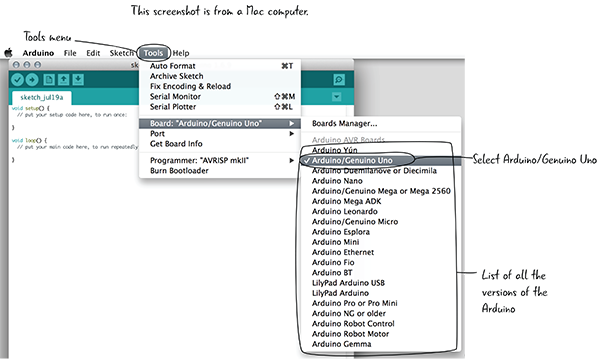

***Figura 4-14***: Seleccionar la placa Arduino

#### Especifique qué puerto está utilizando

Hay un puerto en el Arduino que se comunica con un puerto en su computadora cuando los dos están conectados por un cable USB. Piense en el puerto como el canal a través del cual los dos dispositivos se comunican entre sí. En este momento, debe configurar el IDE de Arduino para que el puerto correcto de su computadora se comunique con su Arduino.

La selección del puerto correcto se ve ligeramente diferente en una computadora Mac y Windows. Vamos a ver capturas de pantalla de ambos. Recuerde, está configurando su computadora para hablar con su Arduino Uno, ya que esa es la versión de Arduino que estamos usando para los proyectos en este libro. Veamos primero Mac; si tienes una PC con Windows, puedes pasar a la siguiente sección.

> **Nota**
> 
> Un puerto es un canal de comunicación que conecta su Arduino y la computadora.

#### Selección de puerto Mac

Para configurar el puerto correcto para que su computadora se comunique con Arduino, vaya al menú Herramientas y seleccione Puerto, como se muestra en la Figura 4-15.

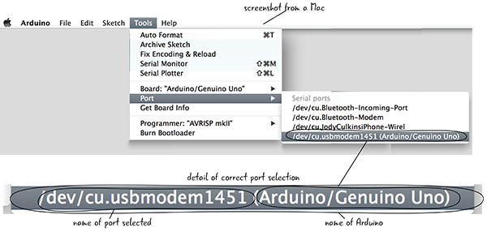

***Figura 4-15***: Seleccionar el puerto correcto

En una Mac, seleccione el puerto cuya descripción incluye ***dev*** y ***cu*** y que está etiquetado como Arduino/Genuino Uno. ***Dev*** es un prefijo agregado por Mac, ***cu*** es la abreviatura de ***call-up*** y Arduino Uno es la versión del hardware Arduino que estás usando. En nuestro ejemplo anterior, el número al final de ese elemento de menú es 1451; en su pantalla, esto será diferente de este ejemplo, y podría ser diferente cada vez que conecte su Arduino. En algunas versiones del software o del sistema operativo, es posible que vea ***tty*** en lugar de ***cu*** en las listas de puertos. Eso también debería funcionar; lo importante es que vea Arduino/Genuino Uno en la descripción del puerto.

No pasará nada malo si selecciona el puerto incorrecto, pero Arduino y su computadora no sabrán cómo comunicarse entre sí. Si parece que Arduino y su computadora no se están comunicando, vuelva a mirar su lista de puertos y asegúrese de haber seleccionado el correcto.

#### Selección de puerto de Windows

Veamos la selección del puerto en una máquina con Windows (Figura 4-16). En una PC, los nombres de los puertos comenzarán con COM. Desea ir al menú Tools, seleccionar Port y luego seleccionar el número COM que coincida con la etiqueta Arduino Uno/Genuino en Puertos serie. Será algo así como COM3 (Arduino Uno/Genuino).

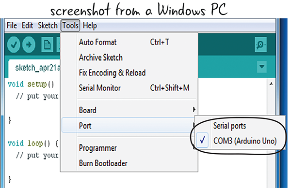

***Figura 4-16***: Seleccionar el puerto correcto

> **¿Preguntas?**
> 
> P: ¿Siempre elegiré el puerto que dice Arduino Uno / Genuino?
> R: No necesariamente. Esa es la versión de la placa Arduino que estamos usando en este libro, por lo que todos los proyectos en el libro usan Arduino Uno, pero es posible que desee usar otras versiones de Arduino a medida que construye sus propios proyectos más adelante.
> 
> P: A veces, hay otros puertos enumerados en el menú desplegable. ¿Qué son?
> R: Esos son otros puertos que utilizan diferentes medios para que su computadora se comunique con otros dispositivos. No se preocupe por ellos, no los usaremos.
> 
> P: ¿Qué pasa si no tengo mi computadora conectada al Arduino? ¿Veré entonces el puerto para conectarme a mi Arduino?
> R: No. Para ver el puerto correcto, debes tener tu Arduino y tu computadora conectados con un cable USB.

Ahora que ha configurado el puerto y la placa Arduino correcta, echemos un vistazo más de cerca al IDE de Arduino utilizado para crear su código.

### ENTENDIENDO LA VENTANA DEL CÓDIGO

Hemos escuchado sobre las partes del IDE de Arduino; ahora echémosle un vistazo más de cerca en la Figura 4-17.

Como en la mayoría del software, hay menús que le permiten realizar varias acciones, como crear nuevos archivos, guardarlos y muchas más, en la parte superior de la interfaz del software. Hay iconos de botones que también le permiten acceder rápidamente a algunas de las acciones que se realizan con más frecuencia. Al hacer clic en el botón Verify, se verifica que no haya errores en su código. Al hacer clic en Upload, se transfiere su código desde su computadora a su Arduino para que pueda ejecutarse en su placa Arduino. Hay una ventana donde escribe su programa y áreas de mensajes que le brindan información sobre ese programa. Explicaremos más sobre los mensajes mientras trabajamos en el IDE; por ahora, sepa que le dicen si su código tiene errores, y también información como la cantidad de espacio que usa en la memoria de Arduino.

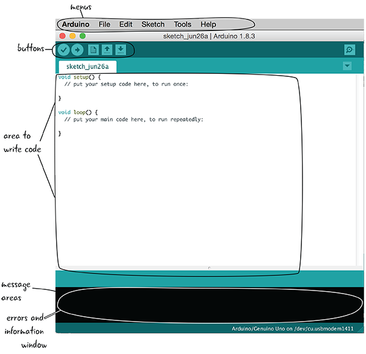

***Figura 4-17***: IDE de Arduino anotado

Miremos un poco más de cerca los botones en la parte superior del editor de código en la Figura 4-18.

Estos botones le permiten acceder rápidamente a las acciones que realizará con más frecuencia con la ventana de código. Estas acciones incluyen verificar si su código tiene algún error (verifying), enviar su código a la placa Arduino (uploading), crear un nuevo archivo, abrir un archivo y guardarlo.

***Figura 4-18***: Botones en el IDE de Arduino

Usaremos todos estos botones en un momento, pero primero aclaremos lo que realmente significa escribir un sketch.

## EL SKETCH: LA UNIDAD BÁSICA DE LA PROGRAMACIÓN ARDUINO

Puede pensar en un programa Arduino, o un sketch, como un grupo completo de instrucciones para realizar tareas específicas. Un sketch incluye todo el código o instrucciones para esa tarea o tareas. Es posible tener varios sketches separados abiertos a la vez, al igual que un programa de hoja de cálculo puede tener más de una hoja abierta a la vez. Echemos un vistazo más de cerca a lo que forma un sketch.

Cada programa que subes a tu Arduino se considera un ***sketch***. Un sketch puede ser bastante simple o extremadamente complejo. Podría encender y apagar un solo LED, o podría controlar 10 o más motores según la entrada del sensor. Aunque cada sketch se corresponde con una tarea, esa tarea podría estar formada por varias partes. Por ejemplo, su programa puede tomar medidas del mundo (como niveles de luz) y usarlas para activar altavoces y LED. Todo eso iría en un solo sketch.

El nombre del sketch aparece en una pestaña en la esquina superior izquierda del editor de código. La Figura 4-19 muestra ejemplos de sketches de Arduino.

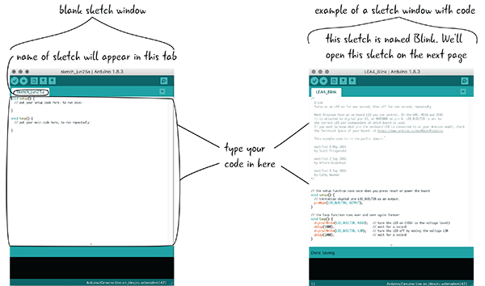

***Figura 4-19***: Una ventana de dibujo en blanco y otra con código escrito en ella

### ABRIR UN SKETCH DE EJEMPLO

Antes de comenzar a escribir su propio código, exploremos un ejemplo que se incluye en el IDE de Arduino. El IDE tiene muchos ejemplos (código de muestra) que demuestran muchas de las cosas que Arduino puede hacer integradas en él. Puede cargar un ejemplo en la ventana de código y cargarlo en su Arduino cuando esté conectado a su computadora.

Primero, abra el sketch de ejemplo llamado **Blink** seleccionando `File > Examples > 01.Basics > Blink`, como se muestra en la Figura 4-20.

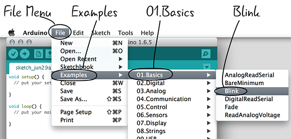

***Figura 4-20***: Abrir el sketch Blink

### GUARDAR SU SKETCH

De forma predeterminada, sus sketches de Arduino se guardarán dentro de la carpeta Arduino dentro de la carpeta Documentos de su computadora. Es una buena idea seguir guardando en este espacio, ya que facilita el regreso a los archivos. Arduino también realiza un seguimiento de los archivos pasados, guardados dentro de esta carpeta en el menú desplegable Sketchbook en el menú File.

Aunque esté utilizando el código de un ejemplo, es mejor guardarlo ahora con un nombre diferente para que siempre pueda volver al código de ejemplo original sin ajustar más adelante. De esa manera, cuando realice cambios y guarde su sketch, sabrá que no ha guardado accidentalmente el sketch de ejemplo de Blink. Guarde su sketch como **LEA4_Blink** para que pueda encontrar sus cambios más tarde.

### ¡GUARDAR PRONTO, GUARDAR A MENUDO!

Adquiera el hábito de guardar sus archivos. Al igual que no querría perder trabajo de un documento u otro proyecto, guardar pronto y con frecuencia puede ayudar a evitar la frustración si por alguna razón su computadora cierra el IDE de Arduino (pérdida de energía, hipo momentáneo, etc.). Aunque las probabilidades de que esto suceda son bajas, la única vez que suceda se alegrará de no tener que repetir todo el trabajo que hizo porque guardó su proyecto y no tiene que preocuparse por ello.

> **Tip**
> 
> Siga guardando sus archivos sketch mientras trabaja.

### CARGANDO UN SKETCH AL ARDUINO

Ahora que ha guardado el sketch de ejemplo con un nuevo nombre, es hora de cargarlo en Arduino. Antes de subirlo, verifiquemos que no haya errores. Aunque esté utilizando el código integrado en el IDE, acostúmbrese a verificar siempre su código antes de cargarlo.

Hay dos botones de los que hablamos anteriormente que debe tener en cuenta cuando esté listo para cargar su código: Verify y Upload. Hemos resaltado ambos botones en la Figura 4-21.

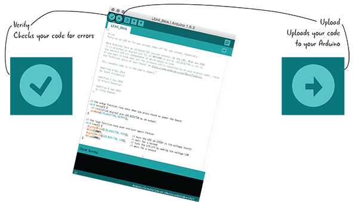

***Figura 4-21***: Botones Verify y Upload en el IDE de Arduino

#### Paso 1: Verifique su Sketch

La verificación garantiza que su código esté configurado correctamente. Haga clic en el botón Verify para asegurarse de que no haya errores (Figura 4-22). A menos que haya realizado cambios en el sketch LEA4_Blink antes de guardarlo, todo funcionará bien.

***Figura 4-22***: El botón Verify

La ventana de mensaje en la parte inferior del IDE que se muestra en la Figura 4-23 mostrará "Done compiling" y no mostrará errores.

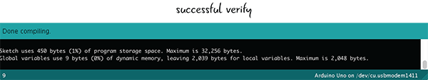

***Figura 4-23***: La ventana message

Cuando verifique su código, recibirá un mensaje que le notifica que algo está mal si hay algún error en su sketch. El IDE de Arduino solo conoce los errores de programación, no los errores que pueda haber cometido al configurar su circuito con Arduino. (Cubriremos esos tipos de errores a medida que avanzamos en el libro). Cuando escribimos texto en la ventana del IDE de Arduino, el código parece algo que los humanos pueden leer, pero Arduino no entiende cómo interpretarlo. Su computadora convierte temporalmente el código a un idioma que Arduino entiende cuando hace clic en Verify para verificar estos errores.

#### Paso 2: Upload tu Sketch

***Figura 4-24***: El botón Upload

Cuando hace clic en Upload (Figura 4-24), su computadora convierte el código a un lenguaje que Arduino entiende y luego comienza a enviar este programa inmediatamente a través del cable USB a su Arduino.

#### Carga Continua: Status Bar y Ventana Message

Una vez que haga clic en el botón Upload, la ventana del IDE de Arduino le dará una status bar que indica cuánto progreso ha hecho la carga y una ventana de mensaje con información como el tamaño del sketch. Esa status bar y la ventana de mensajes se parecen a la Figura 4-25.

Una vez que el archivo se haya enviado a su Arduino, la ventana del mensaje dirá "Done uploading.".

¡Eso es! Ahora su código de la ventana IDE se está ejecutando en Arduino.

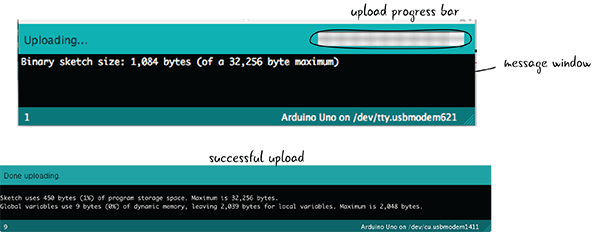

***Figura 4-25***: Upload progress bar

#### Ejecute el Sketch LEA4_Blink

Ahora que ha subido su sketch a Arduino, siempre que Arduino tenga energía de la computadora a través del cable USB, seguirá funcionando. El código que ha subido al Arduino contiene las instrucciones que le dicen a Arduino que haga parpadear la luz una y otra vez. El LED cerca del Pin 13 se encenderá y permanecerá encendido durante un segundo, luego se apagará durante un segundo, una y otra vez. Esto se ilustra en la Figura 4-26. Veremos el código en detalle en breve y veremos exactamente cómo funciona.

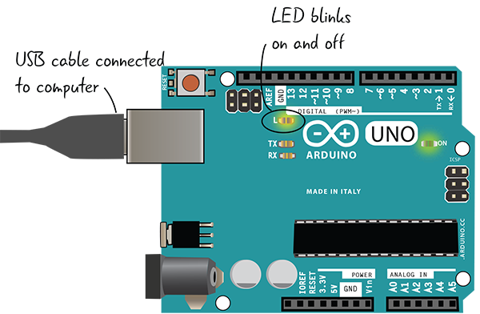

***Figura 4-26***: El LED parpadea.

Si su sketch LEA4_Blink no se está ejecutando, puede volver al proceso metódico utilizado para descubrir qué problema está impidiendo que su código funcione. Ya lo ha visto antes con nuestros dispositivos electrónicos y se conoce como ***debugging - depuración***.

> **Nota**
> 
> ***Debugging*** es el nombre del proceso utilizado para resolver problemas con el circuito y con el código en sus proyectos Arduino.

### DEBUGGING: QUÉ HACER SI EL LED NO ESTÁ PARPADEANDO
AQUIIIIIIIIIIIII
Si la carga se realizó correctamente y el LED parpadea, no hay nada que solucionar. Pero, ¿y si el LED no se enciende? Así como usó la depuración para buscar problemas en su circuito, depurará su código a lo largo del libro, buscando metódicamente los problemas que impiden que su código funcione correctamente. También buscará problemas con la configuración del hardware Arduino. Si tuvo algún problema con su boceto LEA4_Blink, asegúrese de que:

Su cable USB está bien conectado tanto a su computadora como a su Arduino (Figura 4-27).
Ha seleccionado el tipo de placa y el puerto serie correctos en los menús (Figura 4-28).

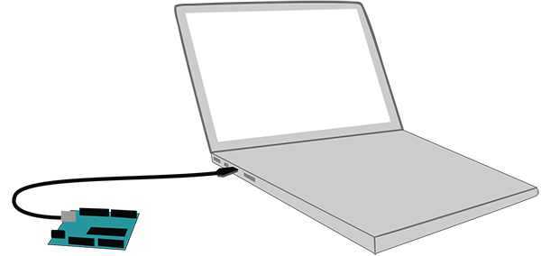
***Figura 4-27***:
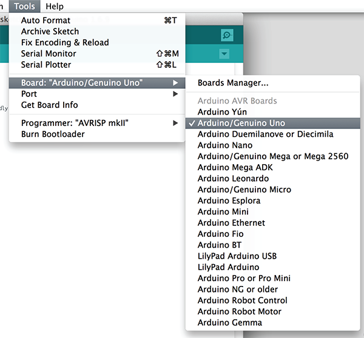
***Figura 4-28***:
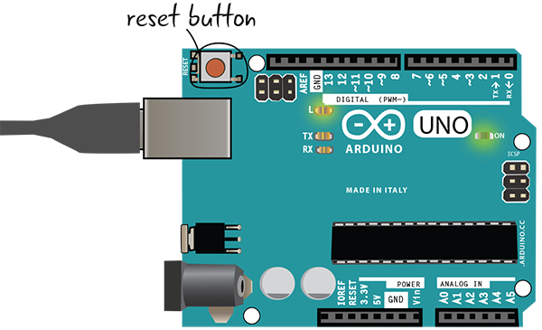
***Figura 4-29***:
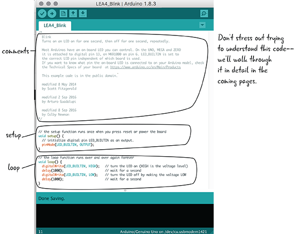
***Figura 4-30***:
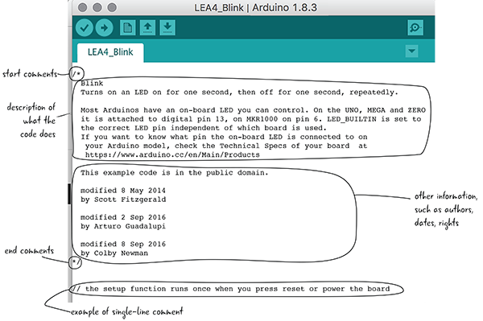
***Figura 4-31***:

***Figura 4-32***:

***Figura 4-33***:

***Figura 4-34***:
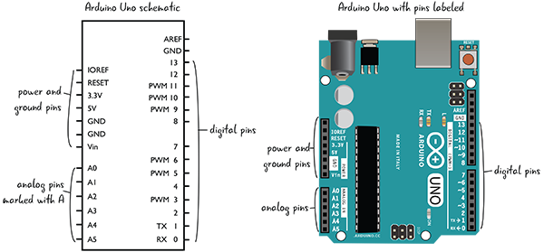
***Figura 4-35***:

***Figura 4-36***:
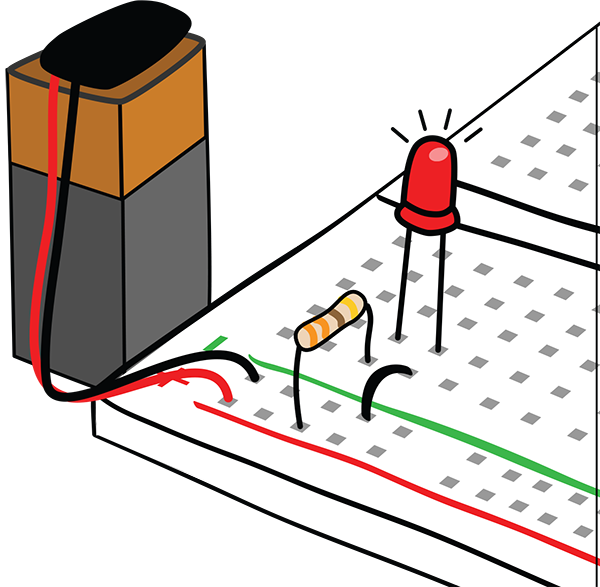
***Figura 4-37***:
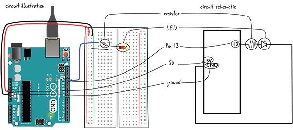
***Figura 4-38***:
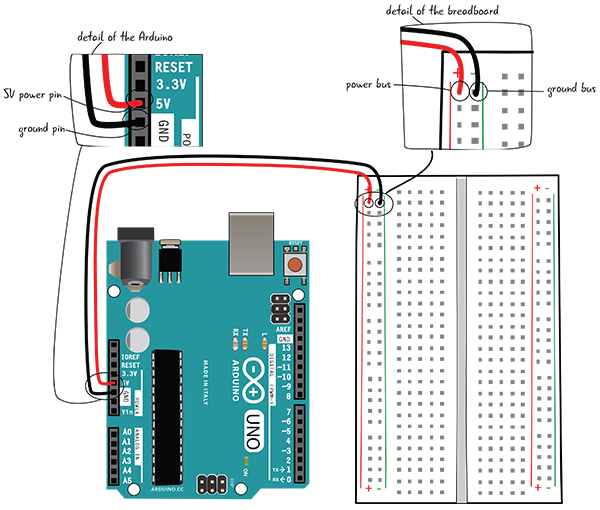
***Figura 4-39***:
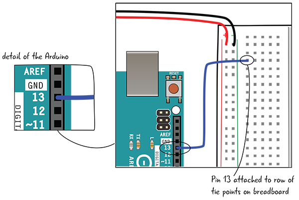
***Figura 4-40***:
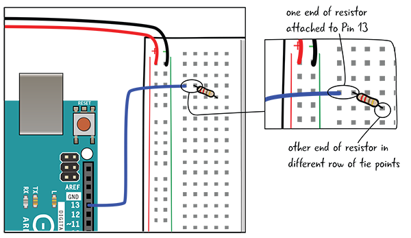
***Figura 4-41***:
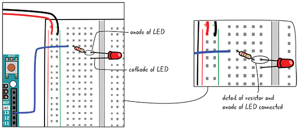
***Figura 4-42***:
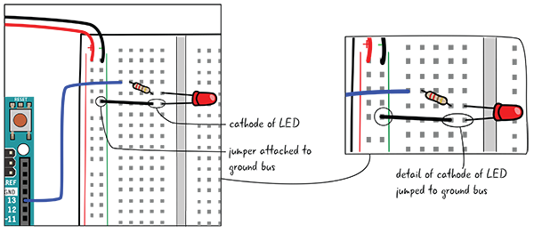
***Figura 4-43***:
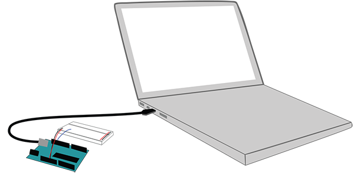
***Figura 4-44***:
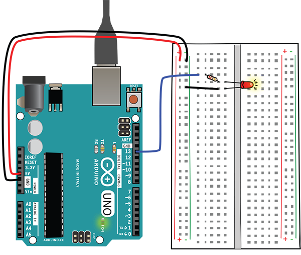
***Figura 4-45***:
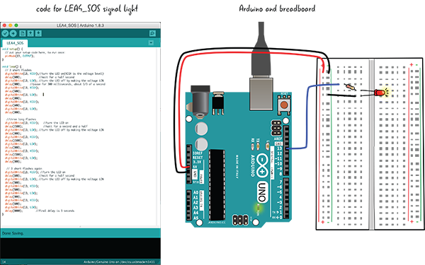
***Figura 4-46***:

***Figura 4-47***:

***Figura 4-48***:
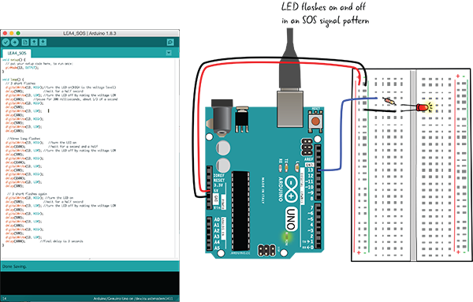
***Figura 4-49***:

